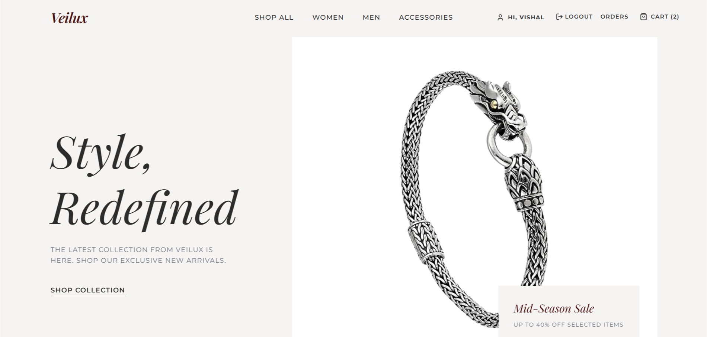

# Veilux — Premium Luxury E-Commerce Platform

Veilux is a high-end, minimalist e-commerce storefront designed with a focus on editorial aesthetics, premium user experience, and a robust full-stack architecture. Inspired by high-fashion boutique layouts, it features an elegant Ivory (`#F6F4F2`) and Charcoal (`#2C2C2C`) visual theme, fluid transitions, and a custom MERN architecture powered by Node.js, Express, MongoDB, and React.



---

## ✨ Features

- **Luxury Aesthetic**: Minimalist editorial typography, curated Ivory/Charcoal palette with gold and crimson accents.
- **Unified MERN Stack**: Built off persistent MongoDB collections, replacing old static Firebase mocks with secure, local database tracking.
- **JWT Authorization**: Custom session security. Registering or logging in issues a signed 30-day JWT which automatically hydra-injects into global Axios headers for secure transactions.
- **Persistent Transactions & Checkout**: Add items as a guest; they dynamically save in your Redux store, and on checkout, they post directly to MongoDB as permanent user orders.
- **Handcrafted Product Catalog**: Exquisite, curated library of **35 unique flagship products** (10 Men's, 10 Women's, and 15 Jewelry) with 100% active, gorgeous Unsplash photo assets—completely free of image repeats.
- **Micro-Animations & Filters**: Smooth animations with custom category filters and price-sorting capabilities.
- **Responsive Layout**: Designed for an outstanding experience on desktop, tablet, and mobile with a bespoke slide-out navigation drawer.

---

## 🛠️ Tech Stack

### Frontend (Client)
- **Framework**: [React 19](https://react.dev/) + [Vite](https://vite.dev/)
- **State Management**: [Redux Toolkit](https://redux-toolkit.js.org/)
- **Network Client**: [Axios](https://axios-http.com/) (configured with global Bearer JWT token hydration)
- **Styling**: [Tailwind CSS v4](https://tailwindcss.com/)
- **Icons**: [Lucide React](https://lucide.dev/)

### Backend (Server)
- **Runtime**: [Node.js](https://nodejs.org/) (configured under clean, standard **CommonJS** loaders)
- **Framework**: [Express.js](https://expressjs.com/)
- **Database ORM**: [Mongoose](https://mongoosejs.com/) connected to a local or cloud **MongoDB** instance
- **Security**: [bcryptjs](https://github.com/dcodeIO/bcrypt.js) password salting, [jsonwebtoken](https://github.com/auth0/node-jsonwebtoken) tokens
- **Utilities**: CORS, dotenv, and Nodemon

---

## 🌐 API Routes Reference

All endpoint queries are mounted under `/api` in the backend server:

| Endpoint | HTTP Method | Access | Description |
|---|---|---|---|
| **Authentication** | | | |
| `/api/auth/signup` | POST | Public | Creates a new user, returns JWT and user profile |
| `/api/auth/login` | POST | Public | Authenticates credentials, returns JWT and profile |
| `/api/auth/me` | GET | Private (JWT) | Retrieves profile of the logged-in user |
| **Product Catalog** | | | |
| `/api/products` | GET | Public | Fetches all products (supports categories, e.g. `?category=jewelery`) |
| `/api/products/:id`| GET | Public | Fetches a single detailed product by its numerical ID |
| `/api/products` | POST | Private (Admin) | Allows admins to create new products in the catalog |
| **Transaction Orders** | | | |
| `/api/orders` | POST | Private (JWT) | Saves shopping bag checkouts as persistent orders |
| `/api/orders` | GET | Private (JWT) | Loads the chronological order history of the logged-in user |
| **Server Diagnostics** | | | |
| `/api/health` | GET | Public | Validates backend server execution status |

---

## 📂 Project Architecture

```text
Veilux/
├── Backend/                   # Node.js & Express Server (CommonJS)
│   ├── server.js              # Entry point: DB connection & Server listener
│   ├── src/
│   │   ├── app.js             # Express app setup & global route mounts
│   │   ├── config/
│   │   │   └── db.js          # Mongoose database connector
│   │   ├── controllers/       # Business controllers (Auth, Products, Orders)
│   │   ├── middleware/        # JWT verification & global error handlers
│   │   ├── models/            # Mongoose Schema Definitions (User, Product, Order)
│   │   ├── utils/             # Helper tools (generateToken.js)
│   │   └── scripts/           # DB Seeder script (seed.js)
│   ├── .env                   # Environmental configurations & MONGO_URI
│   └── package.json           # Backend scripts and dependencies
│
├── Frontend/                  # React Client (Vite)
│   ├── src/
│   │   ├── api/
│   │   │   └── productsAPI.js # Queries backend endpoints using Axios
│   │   ├── components/        # Shared elements (Navbar, ProductGrid, etc.)
│   │   ├── pages/             # App pages (Login, Cart, OrderHistory, etc.)
│   │   ├── redux/             # Store & global slices configuration
│   │   ├── App.jsx            # Dynamic JWT session hydrator & Router
│   │   └── index.css          # Tailwind CSS v4 styling setup
│   └── package.json           # Frontend dependencies
│
└── .gitignore                 # Root-level unified git ignore config
```

---

## 🚀 Getting Started

### 1. Prerequisites
- [Node.js](https://nodejs.org/) (v18+)
- [MongoDB](https://www.mongodb.com/) (running locally or a remote MongoDB Atlas URI)

### 2. Backend Setup
1. Open your terminal and navigate to the `Backend` directory:
   ```bash
   cd Backend
   ```
2. Install the server-side dependencies:
   ```bash
   npm install
   ```
3. Create a `.env` file in the `Backend` folder and populate it with your environment variables:
   ```env
   PORT=5000
   MONGO_URI=your_mongodb_connection_string
   JWT_SECRET=your_jwt_signing_secret_key
   NODE_ENV=development
   ```
4. **Seed the database** to load the 35 premium luxury products:
   ```bash
   npm run seed
   ```
5. Start the backend development server (hot-reloads with Nodemon):
   ```bash
   npm run dev
   ```

### 3. Frontend Setup
1. Open a **new terminal tab** and navigate to the `Frontend` directory:
   ```bash
   cd Frontend
   ```
2. Install the client-side dependencies:
   ```bash
   npm install
   ```
3. Start the Vite development server:
   ```bash
   npm run dev
   ```
4. Open your browser and go to `http://localhost:5173/` to enjoy the full luxury storefront!

---

Designed with ❤️ by [Vishal Fulkar](https://github.com/VishalFulkar)
